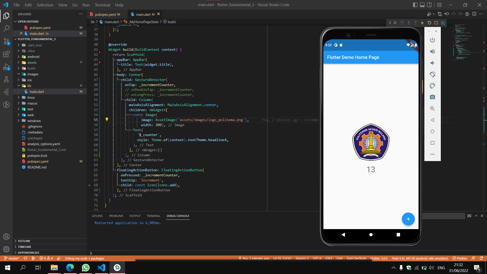
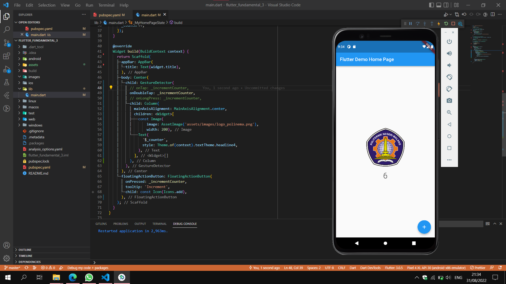
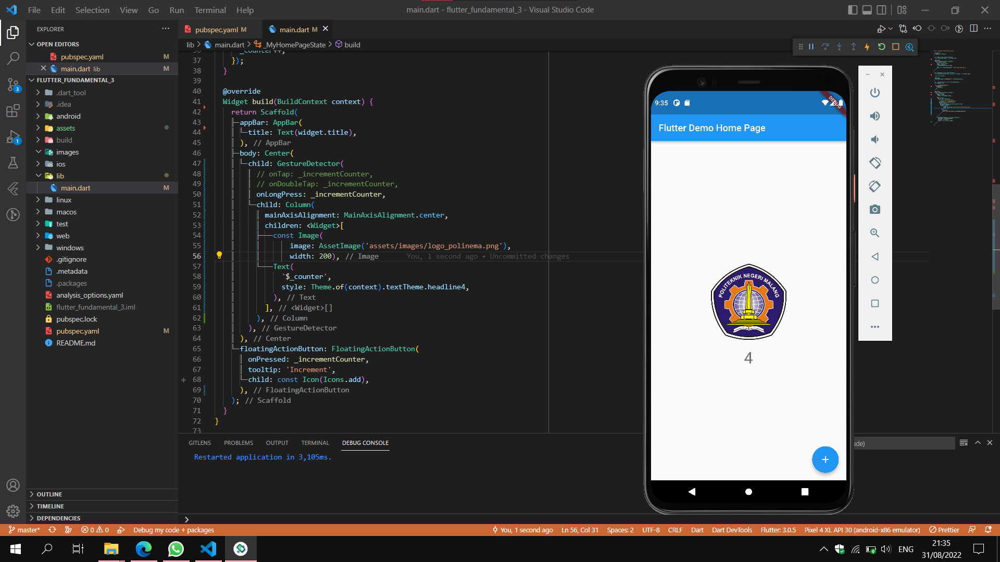
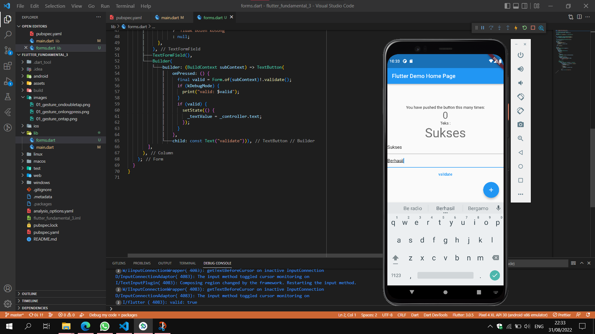
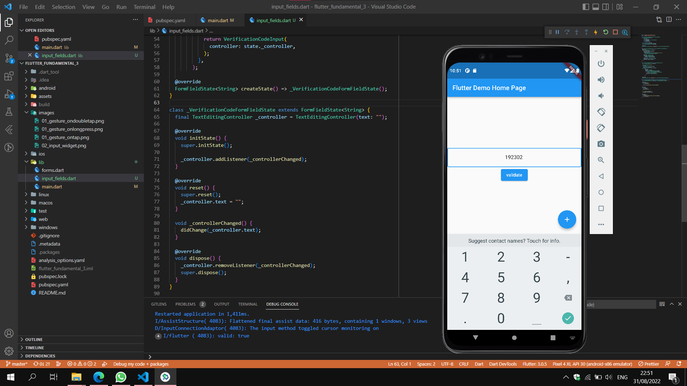

# flutter_fundamental_3

A new Flutter project.

## Praktikum 1 - menerapkan Gesture Detector

Pada child dari widget Center ditambahkan widget GestureDetector yang akan menerima berbagai jenis interaksi dari user. Dari hasil screenshot diatas gesture detector menerapkan interaksi onTap yang artinya jika ditekan sekali maka akan mentrigger fungsi \_incrementCounter.

GestureDetector berikutnya menerapkan interaksi onDoubleTap yang mana untuk mentrigger fungsi \_incrementCounter, user perlu klik 2 kali pada bagian widget yang menjadi child dari widget GestureDetector.

GestureDetector yang terakhir menerapkan interaksi onLongPress yang mana user perlu menekan dan tahan widget yang menjadi child dari widget GestureDetector untuk mentrigger fungsi \_incrementCounter,.

## Praktikum 2 - menerapkan input widget dan forms

Pada contoh program diatas terdapat sebuah input dan hasil keluaran yang dihasilkan. Widget input diatas dibangun di dalam class FormContoh yang mana pada fungsi build terdapat widget TextFormField, Text, dan Builder yang diapit oleh class Form yang memiliki GlobalKey untuk menyimpan state dari widget.

Pada widget TextFormField berisi properti controller yang digunakan untuk mengatur nilai yang tersimpan di dalam widget tersebut. Controller di definisikan dengan nilai default "Initial Value" pada objek \_controller. Kemudian objek \_controller dipanggil pertama kali pada saat program dijalankan untuk menjalankan fungsi addListener yang menerima anonymous function. Di dalam fungsi tersebut diisi dengan pembaharuan nilai dari \_controller yang disimpan ke variabel \_textValue. Sehingga setiap terjadi perubahan nilai di input, maka otomatis di update oleh fungsi tersebut.

Pada widget Builder ditambahkan widget Button yang digunakan untuk memvalidasi dan menampilkan hasil input dari user. Untuk memvalidasinya dengan ditambahkan variabel valid yang memiliki Form of context yang digunakan untuk mencari Form dari context diatasnya untuk divalidasi.

Jika true maka akan mencetak hasil sebagai true dan ditampilkan sebagai keluaran di widget Text.

## Praktikum 3 - menerapkan custom input dan FormField widget

class VerificationCodeInput yang mengextends Stateful memiliki variable dan konstruktor yang menerima beberapa parameter seperti controller dsb.
Kemudian di class state nya di dalam metod build mengembalikan widget TextField yang diisi dengan berbagai properti seperti controller yang diterima dari class widgetnya dan properti decoration untuk menghias sisi input.

Pada pengaturan format yang bisa diterima input, diatur diatur dalam properti inputFormatters yang berisi array. Input dibatasi hanya untuk jenis angka 0-9 menggunakan regex di dalam class FilteringTextInputFormatter dan 6 digit angka dengan class LengthLimitingTextInputFormatter.

Untuk class yang akan ditambahkan ke class HomePage dari main.dart ditambahkan class baru yang mengextends FormField dengan nama VerificationCodeFormField. Di dalam konstruktor VerificationCodeFormField menerima beberapa parameter seperti key, onSaved, controller, dan validator.

Pada class super menambahkan nilai pada properti key, validator dan builder, builder berisi sebuah fungsi yang menerima parameter FormFieldState. Di dalam fungsi tersebut dibuat objek dari class saat ini yaitu \_VerificationCodeFormFieldState dengan nama state yang akan dikembalikan ke class widget sebelumnya yaitu VerificationCodeInput sebagai nilai dari parameter controller.
